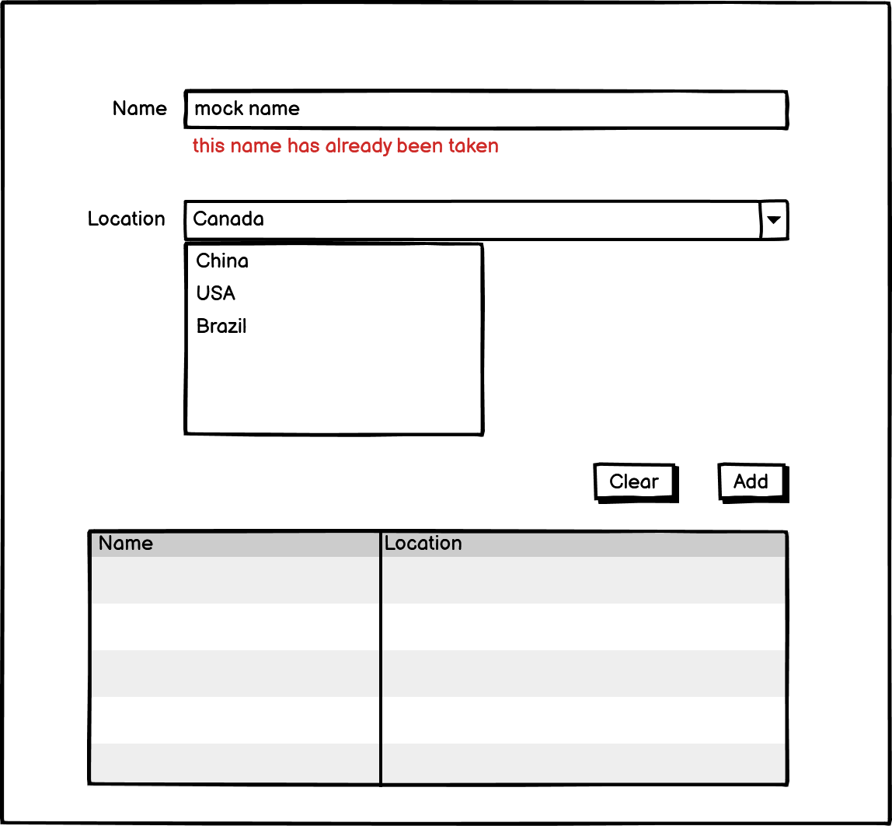
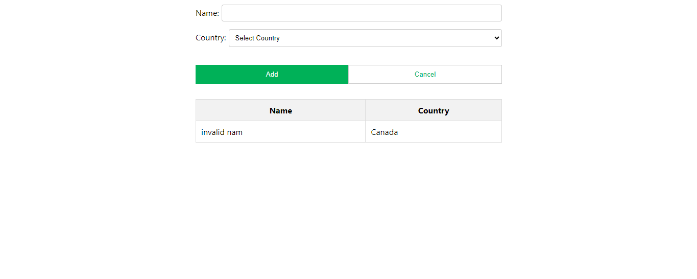
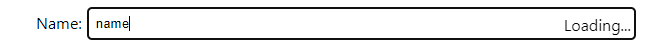
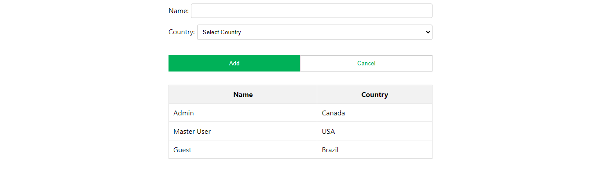

# react-interview-q1

## Instructions

Clone this repo first into your own github account. Make sure to thoroughly read the instructions and implement the react component to meet the provided requirements. Send back a link to your cloned repo. You are expected to make implementation choices around customer experience and efficiency. Please make sure to explain your choices in comments.

## Requirements

Please build the following form component

* Name input should be validated using the provided mock API to check whether the chosen name is taken or not.
* Location dropdown options should be fetched using the provided mock API.
* Component should have a responsive layout
* Component should be appropriately styled
* Unit tests are not required

## Solution

# To run the solution

* Move to the directory solution
* npm install & npm start
* You will First see this Interface

# Input Name
* When we type input it tests the name validity in realtime  and show a loading sign.

# Wrong Name Input
* When we type the invalid name then a red color callout is shown and Add button is disabled.
  

# Country Dropdown
* A country can be selected. These country names are being fetched from the API.
  

# Table
* When we click on button Add with both the valid inputs then users are added to the table.
  
